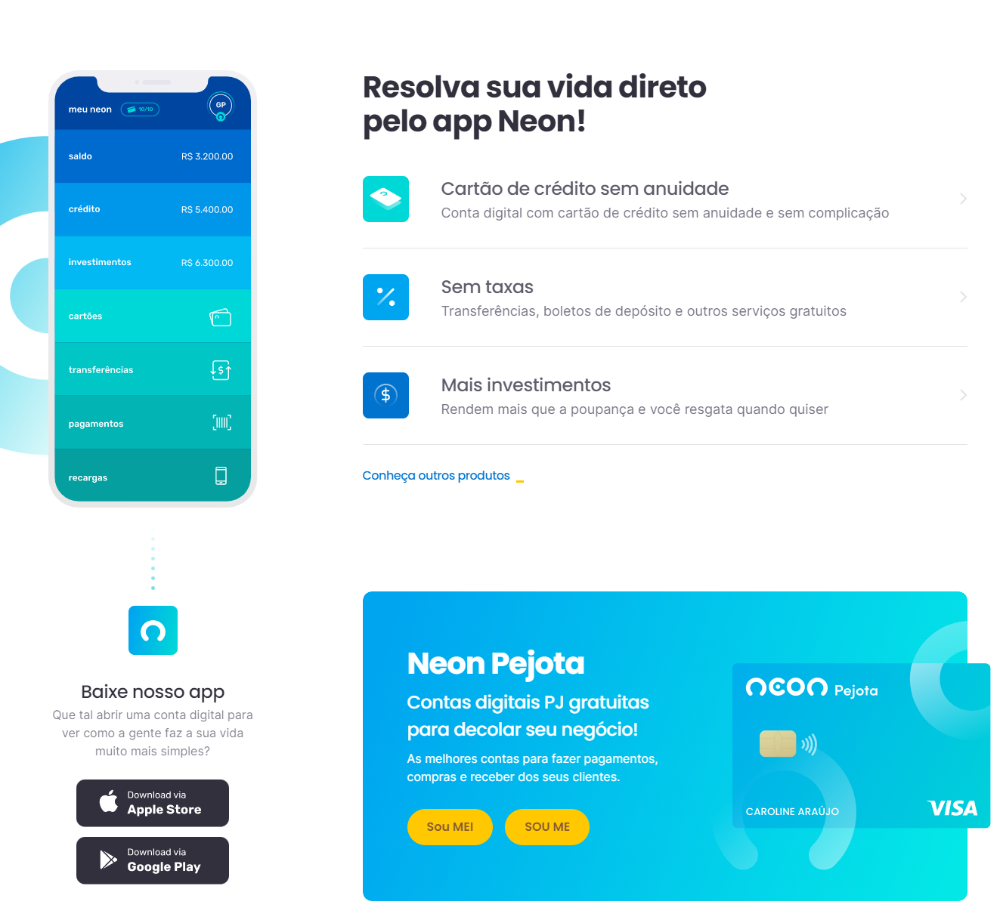
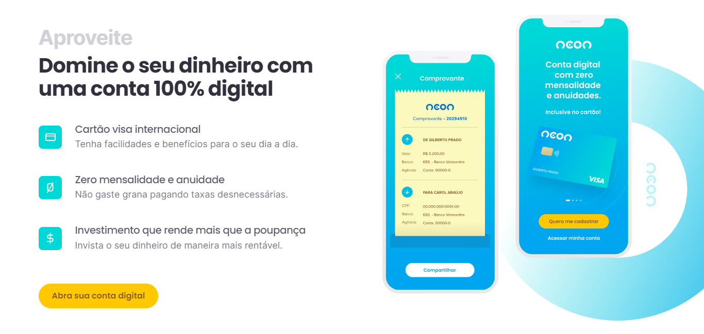
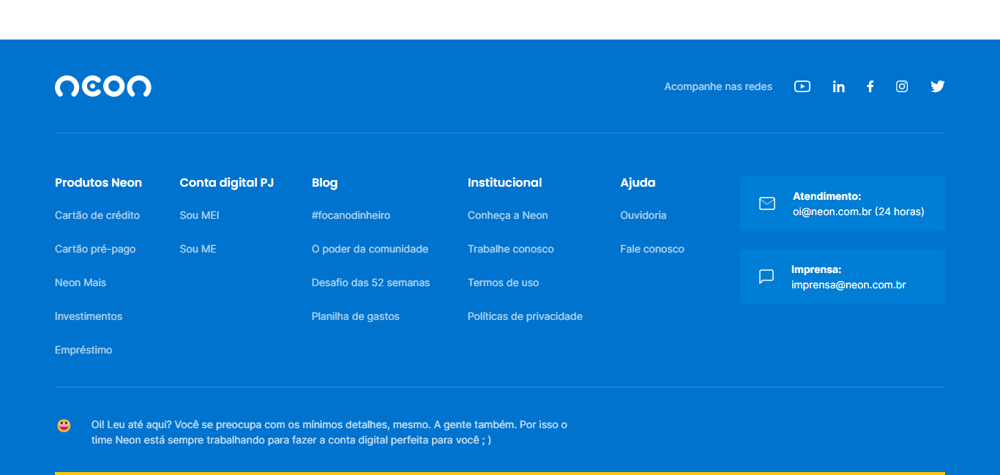

# NEON Landing Page

# Sobre o projeto

https://landingpage-neon.netlify.app/

A NEON Landing Page é uma aplicação Web Front-End responsiva de um banco digital construída durante o curso Codeboost, com o objetivo de colocar em prática as minhas habilidades em JavaScript.

# Tecnologias utilizadas

## Front end
- HTML
- CSS
- SASS
- JavaScript

# Autora

Lorena Lima

https://www.linkedin.com/in/lorena-lima-b79a32186/

## Imagens

